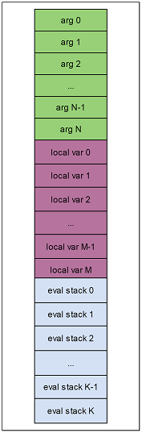
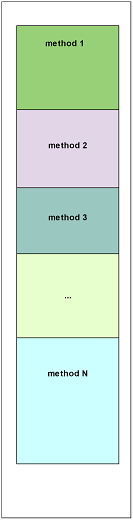
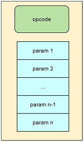

# huatuo指令集设计

原始IL指令集是基于栈的指令集，优点是指令个数少、优雅、紧凑，非常适合表示虚拟机逻辑，但并不适合被解释器高效解释运行。因此我们需要将它转换为自定义的另一种能够高效
解释执行的指令集，然后再在我们的解释器中运行。

## IL指令集的缺陷

- IL是基于栈的指令，运行时维护执行栈是个无谓的开销
- IL有大量单指令多功能的指令，如add指令可以用于计算int、long、float、double类型的和，导致运行时需要根据上文判断到底该执行哪种计算。不仅增加了运行时判定的开销，还增加了运行时维护执行栈数据类型的开销
- IL指令包含一些需要运行时resolve的数据，如newobj指令第一个参数是method token。token resolve是一个开销很大的操作，每次执行都进行resolve会极大拖慢执行性能
- IL是基于栈的指令，压栈退栈相关指令数较多。像a=b+c这样的指令需要4条指令完成，而如果采用基于寄存器的指令，完全可以一条指令完成。
- IL不适合做其他优化操作，如我们的InitOnce JIT技术。
- 其他

## huatuo令集设计目标

huatuo指令集设计目标就是解决原始IL的缺陷，以及做一些更高级的优化，目前主要包含以下功能

- 指令中包含要操作的目标地址，不再需要维护栈
- 对于单指令多功能指针需要为每种操作数据类型维护一个对应指令，免去运行时维护类型及判定类型的开销。如如add指令，要特例化为add_int、add_long之类的指令
- 对于涉及到token解析的指令，尽量转换指令时直接固定，省去计算或者查询的开销。如 newobj中 method token字段，直接转变成 MethodInfo* 元数据
- 对于一些常见操作如 a = b + c，需要 `ldloc b , ldloc c, add, stloc a` 这4条指令，我们希望提供专用指令折叠它
- 需要能与一些常见的优化技术配合，如函数inline、InitOnce动态jit技术
- 需要考虑到跨平台问题，如在armv7这种要求内存对齐的硬件上，也能高效执行

huatuo使用经典的寄存器指令集配合一些其他运行时设施实现以上目标。

## 运行环境

无论指令的内容如何，指令的执行结果必须产生副作用（哪怕是nop这种什么也不干的指令，也导致当前指令寄存器ip发生变化），而这些副作用，必然作用于运行环境（甚至有可能作用于指令本身，如InitOnce技术）。正因为指令执行离不开具体的执行环境，指令设计必然跟huatuo解释器及il2cpp运行时的运行环境紧密相关。

### huatuo函数帧栈

大多数基础指令都是操作 函数参数、局部变量、执行栈顶的数据，在huatuo中使用数据栈来存放这些数据，并以逻辑地址（类型uint16_t）来标识要操作的数据的位置。逻辑地址是局部的，每个函数的执行栈帧的逻辑地址从0开始，最大2^16-1。

逻辑地址的布局如下



函数帧根据其嵌套顺序，在数据栈上的位置从低位向高位扩展，如下图



数据栈每个slot都为一个size=8的StackObject类型对象，每个变量可能占1个或多个slot。例如int类型变量只占一个slot，但Vector3类型变量占2个slot。

localVarBase 指针为函数帧栈的基准位置。

```cpp
union StackObject
{
    void* ptr; // can't adjust position. will raise native_invoke init args bugs.
    bool b;
    int8_t i8;
    uint8_t u8;
    int16_t i16;
    uint16_t u16;
    int32_t i32;
    uint32_t u32;
    int64_t i64;
    uint64_t u64;
    float f4;
    double f8;
    Il2CppObject* obj;
    Il2CppString* str;
    Il2CppObject** ptrObj;
};

StackObject* localVarBase;
```

### 运行时相关

除了只操作函数帧栈及当前函数状态的指令外，剩下的指令都要依赖于il2cpp运行时及huatuo解释器执行环境MachineState提供的api才能完成功能。更细化地说，又分为几类

- metadata数据相关。如typeof指令，依赖于运行时将token转换为Il2Class*运行时metadata
- 对象相关。如 ldsfld指令 类型静态成员访问
- gc相关。如newobj指令依赖于gc相关机制分配对象内存
- 多线程相关。如ThreadStatic类型的类静态成员变量
- 其他一些特殊机制。如localloc指令依赖于 huatuo的MachineState提供api来分配内存

## 指令结构

huatuo指令结构如下



其中指令的前2字节是opcode，剩下的指令数据我们称之为指令param。param分为几种类型：

- 数据逻辑地址。
- 普通字面常量。比如`a = b + 5`，其中常量5必然要体现到指令之中
- resolve后的数据。如 `ldtoken`，为了优化性能不想每次执行时计算token，那就必然要把运行时resolve好的token对应的元数据包含到指令中
- resolve后的数据的指针。一些指令中包含不定长度的数据，如switch语句可能包含n个case项目的跳转地址。为了让指令本身大小固定，我们将这些不定长的数据存到InterpMethodInfo的resolvedDatas中，用一个uint32_t的索引指向它的位置。
- 其他一些辅助数据
- 为了保证param内存对齐访问而插入的padding参数

## 跨平台兼容性

指令直接相关的跨平台兼容性问题主要是内存对齐问题。目前arm64 CPU支持非对齐的内存访问，但armv7仍然要求内存对齐，否则一旦发生非对齐访问，要么就运行效率大幅下降，要么直接导致崩溃。
尽管可以针对64位和32位设计两套完全不同的指令，但出于方便维护、养活bug考虑，huatuo还是统一使用了一套指令集。

huatuo指令的一些设计约束：

- 每条指令的前2字节必须为opcode
- 满足内存对齐。指令param的size可能是1、2、4、8。为了满足内存对齐的要求，我们在param之间插入一些uint8_t类型的无用padding数据。

### padding优化

为了最大程度减少浪费的padding数据空间，我们将所有param排序，从小到大排列，同时插入padding以满足内存对齐。经过不太复杂的推理，我们可以知道，每条指令最多浪费 **7** 字节的padding空间。

## 指令实现

由于IL指令众多，我们无法一一介绍所有指令对应的huatuo指令集设计，我们分为几大类详细介绍。

### 空指令

如nop、pop指令，直接在transform阶段就被消除，完全不产生对应的huatuo指令。

### 简单数据复制指令

典型有

- 操作函数参数的指令。如 ldarg、starg、ldarga
- 操作函数局部变量的指令。如 ldloc、stloc、ldloca
- 隐含操作eval stack栈顶数据的指令。如add、dup

对于操作函数帧栈的指令，一般要做以下几类处理

- 为源数据和目标数据添加对应的逻辑地址字段
- 对于源数据或者目标数据有多个变种的指令，统一为带逻辑地址字段的指令。如ldarg.0 - ldarg.3、ldarg、ldarg.s 都统一为一条指令。

以典型的ldarg指令为例。如果被操作函数参数的类型为int时，对应的huatuo指令为

```cpp
struct IRCommon
{
    uint16_t opcode;
}

struct IRLdlocVarVar : IRCommon
{
    uint16_t dst; 
    uint16_t src;
    uint8_t __pad6;
    uint8_t __pad7;
};

//  对应解释执行代码
case HiOpcodeEnum::LdlocVarVar:
{
    uint16_t __dst = *(uint16_t*)(ip + 2);
    uint16_t __src = *(uint16_t*)(ip + 4);
    (*(uint64_t*)(localVarBase + __dst)) = (*(uint64_t*)(localVarBase + __src));
    ip += 8;
    continue;
}

```

- dst 指向当前执行栈顶的逻辑地址
- src ldarg中要加载的变量的逻辑地址
- __pad6 为了内存对齐而插入的
- __pad7 同上

### 需要expand目标数据的指令

根据CLI规范，像byte、sbyte、short、ushort这种size小于4的primitive类型，以及underlying type为这些primitive类型的枚举，它们被加载到evaluate stack时，需要符号扩展为int32_t类型数据。我们不想执行ldarg指令时作运行时判断，因为这样会降低性能。因此为这些size小于4的操作，单独设计了对应的指令。

以byte类型为例，对应的huatuo指令为

```cpp
struct IRLdlocExpandVarVar_u1 : IRCommon
{
    uint16_t dst;
    uint16_t src;
    uint8_t __pad6;
    uint8_t __pad7;
};

//  对应解释执行代码
case HiOpcodeEnum::LdlocExpandVarVar_u1:
{
    uint16_t __dst = *(uint16_t*)(ip + 2);
    uint16_t __src = *(uint16_t*)(ip + 4);
    (*(int32_t*)(localVarBase + __dst)) = (*(uint8_t*)(localVarBase + __src));
    ip += 8;
    continue;
}
```

### 静态特例化的指令

有一类指令的实际执行方式跟它的参数类型有关，如add。当操作的数是int、long、float、double时，执行对应类型的数据相加操作。但实际上由于IL程序的静态性，每条指令操作的数据类型肯定是固定的，并不需要运行时维护数据类型，并且根据数据类型决定执行什么操作。我们使用一种叫`静态特例化`的技术，为这种指令设计了多条huatuo指令，在transform时，根据具体的操作数据类型，生成相应的指令。

以add 对两个int32_t类型数据相加为例

```cpp
struct IRBinOpVarVarVar_Add_i4 : IRCommon
{
    uint16_t ret;
    uint16_t op1;
    uint16_t op2;
};

//  对应解释执行代码
case HiOpcodeEnum::BinOpVarVarVar_Add_i4:
{
    uint16_t __ret = *(uint16_t*)(ip + 2);
    uint16_t __op1 = *(uint16_t*)(ip + 4);
    uint16_t __op2 = *(uint16_t*)(ip + 6);
    (*(int32_t*)(localVarBase + __ret)) = (*(int32_t*)(localVarBase + __op1)) + (*(int32_t*)(localVarBase + __op2));
    ip += 8;
    continue;
}
```

### 直接包含常量的指令

有一些指令包含普通字面常量，如ldc指令。相应的寄存器指令只是简单地添加了相应大小的字段。

以ldc int32_t类型数据为例

```cpp
struct IRLdcVarConst_4 : IRCommon
{
    uint16_t dst;
    uint32_t src;
};

// 对应解释执行代码
case HiOpcodeEnum::LdcVarConst_4:
{
    uint16_t __dst = *(uint16_t*)(ip + 2);
    uint32_t __src = *(uint32_t*)(ip + 4);
    (*(int32_t*)(localVarBase + __dst)) = __src;
    ip += 8;
    continue;
}
```

### 隐含常量的指令

有一些指令隐含了所操作的常量，如 ldnull、ldc.i4.0 - ldc.i4.8 等等。对于这类指令，如果有对应的`直接包含常量的指令`的实现，则简单转换为 上一节中介绍的 `直接包含常量的指令`。后续可能会进一步优化。

以ldnull为例

```cpp
struct IRLdnullVar : IRCommon
{
    uint16_t dst;
    uint8_t __pad4;
    uint8_t __pad5;
    uint8_t __pad6;
    uint8_t __pad7;
};

// 对应解释执行代码
case HiOpcodeEnum::LdnullVar:
{
    uint16_t __dst = *(uint16_t*)(ip + 2);
    (*(void**)(localVarBase + __dst)) = nullptr;
    ip += 8;
    continue;
}

```

#### 指令共享

为了减少指令数量，操作相同size常量的ldc指令会被合并为同一个。如ldloc.r4 指令就被合并到ldloc.i4指令的实现。

### 包含resolved后数据的指令

有一些指令包含metadata token，如sizeof、ldstr、newobj。为了避免巨大的运行时resolve开销，huatuo在transform这些指令时就已经将包含token数据resolve为对应的runtime metadata。

更细致一些，又分为两类。

#### 直接包含resolved后数据的指令

以sizeof为例，原始指令token为类型信息，transform时，直接计算了对应ValueType的size，甚至都不需要专门为sizeof设计对应的指令，直接使用现成的LdcVarConst_4指令。

```cpp
case OpcodeValue::SIZEOF:
{
    uint32_t token = (uint32_t)GetI4LittleEndian(ip + 2);
    Il2CppClass* objKlass = image->GetClassFromToken(token, klassContainer, methodContainer, genericContext);
    IL2CPP_ASSERT(objKlass);
    int32_t typeSize = GetTypeValueSize(objKlass);
    CI_ldc4(typeSize, EvalStackReduceDataType::I4);
    ip += 6;
    continue;
}
```

### 间接包含resolved后数据的指令

像ldstr、newobj这些指令包含的token经过resolve后，变成对应runtime metadata的指针，考虑到指针在不同平台大小不一，因此不直接将这个指针放到指令中，而是换成一个uint32_t类型的指向InterpMethodInfo::resolvedData字段的index param。执行过程中需要一次向resolvedData的查询操作，时间复杂度为O(1)。


以newobj指令为例

```cpp
struct IRLdstrVar : IRCommon
{
    uint16_t dst;
    uint32_t str;
};

// 对应解释执行代码
case HiOpcodeEnum::LdstrVar:
{
    uint16_t __dst = *(uint16_t*)(ip + 2);
    uint32_t __str = *(uint32_t*)(ip + 4);
    (*(Il2CppString**)(localVarBase + __dst)) = ((Il2CppString*)imi->resolveDatas[__str]);
    ip += 8;
    continue;
}  

```

### 分支跳转指令

原始IL字节码使用了相对offset的跳转目标，并且几乎为每条跳转相关指令都设计了near和far offset 两条指令，huatuo为了简单起见，直接使用4字节的绝对跳转地址。

以br无条件跳转指令为例

```cpp

struct IRBranchUncondition_4 : IRCommon
{
    uint8_t __pad2;
    uint8_t __pad3;
    int32_t offset;
};

// 对应解释执行代码
case HiOpcodeEnum::BranchUncondition_4:
{
    int32_t __offset = *(int32_t*)(ip + 4);
    ip = ipBase + __offset;
    continue;
}
```

offset为转换后的指令地址的绝对偏移。

### 对象成员访问指令

由于字段在对象中的偏移已经完全确定，transform时计算出字段在对象中的偏移，保存为指令的offset param, 执行时根据对象大小，使用this指针和偏移，直接访问字段数据。

以ldfld 读取int类型字段为例

```cpp

struct IRLdfldVarVar_i4 : IRCommon
{
    uint16_t dst;
    uint16_t obj;
    uint16_t offset;
};

// 对应解释执行代码
case HiOpcodeEnum::LdfldVarVar_i4:
{
    uint16_t __dst = *(uint16_t*)(ip + 2);
    uint16_t __obj = *(uint16_t*)(ip + 4);
    uint16_t __offset = *(uint16_t*)(ip + 6);
    CHECK_NOT_NULL_THROW((*(Il2CppObject**)(localVarBase + __obj)));
    (*(int32_t*)(localVarBase + __dst)) = *(int32_t*)((uint8_t*)(*(Il2CppObject**)(localVarBase + __obj)) + __offset);
    ip += 8;
    continue;
}

```

### ThreadStatic 成员访问指令

在初始化Il2CppClass时，如果它包含ThreadStatic属性标记的静态成员变量，则为它分配一个可以放下这个类型所有ThreadStatic变量的ThreadLocalStorage的连续空间。
借助于il2cpp运行时对ThreadStatic的支持，相关指令实现相当简单直接。

以ldsfld指令为例

```cpp

struct IRLdthreadlocalVarVar_i4 : IRCommon
{
    uint16_t dst;
    int32_t offset;
    int32_t klass;
};

// 对应解释执行代码
case HiOpcodeEnum::LdthreadlocalVarVar_i4:
{
    uint16_t __dst = *(uint16_t*)(ip + 2);
    uint32_t __klass = *(uint32_t*)(ip + 8);
    int32_t __offset = *(int32_t*)(ip + 4);

    Il2CppClass* _klass = (Il2CppClass*)imi->resolveDatas[__class];
    Interpreter::RuntimeClassCCtorInit(_klass);
    (*(int32_t*)(localVarBase + __dst)) = *(int32_t*)((byte*)il2cpp::vm::Thread::GetThreadStaticData(_klass->thread_static_fields_offset) + __offset);
    ip += 16;
    continue;
}
```

### 数组访问相关指令

比较常规直接，不过有个特殊点：根据规范index变量可以是i4或者native int类型。由于数组访问是非常频繁的操作，我们不想插入运行时数据类型类型及转换，因为我们根据index变量的size为每条数组相关指令设计了2条huatuo指令。

以ldelem.i4 指令的index是i4类型的情形为例

```cpp
struct IRGetArrayElementVarVar_i4_4 : IRCommon
{
    uint16_t dst;
    uint16_t arr;
    uint16_t index;
};

// 对应解释执行代码
case HiOpcodeEnum::GetArrayElementVarVar_i4_4:
{
    uint16_t __dst = *(uint16_t*)(ip + 2);
    uint16_t __arr = *(uint16_t*)(ip + 4);
    uint16_t __index = *(uint16_t*)(ip + 6);
    Il2CppArray* arr = (*(Il2CppArray**)(localVarBase + __arr));
    CHECK_NOT_NULL_AND_ARRAY_BOUNDARY(arr, (*(int32_t*)(localVarBase + __index)));
    (*(int32_t*)(localVarBase + __dst)) = il2cpp_array_get(arr, int32_t, (*(int32_t*)(localVarBase + __index)));
    ip += 8;
    continue;
}  
```

### 函数调用指令

目前调用AOT函数和调用Interpreter函数使用不同的指令，因为Interpreter函数可以直接复用已经压到栈顶的数据，可以完全优化掉 Manged2Native -> Native2Managed 这个过程，提升性能。

调用解释器函数时可以复用当前 InterpreterModule::Execute函数帧，也节省了函数调用开销，同时也避免了解释器嵌套调用过深导致native栈overflow的问题。

对于带返回值的函数，由于多了一个返回值地址参数ret，与返回void的函数分别设计了不同指令。

如果调用的是AOT函数，由于每条函数的参数不定，我们将参数信息记录到resolvedDatas，然后argIdxs中保存这个间接索引。另外还需要通过桥接函数完成解释器函数参数到native abi函数参数的转换，为了避免运行时查找的开销，也提前计算了这个桥接函数，记录到resolvedDatas中，然后在managed2NativeMethod中保存了这个间接索引。

以call指令为例，为它设计了5条指令

- IRCallNative_void
- IRCallNative_ret
- IRCallNative_ret_expand
- IRCallInterp_void
- IRCallInterp_ret

以IRCallNative_ret的实现为例，介绍调用AOT函数的指令：

```cpp

struct IRCallNative_ret : IRCommon
{
    uint16_t ret;
    uint32_t managed2NativeMethod;
    uint32_t methodInfo;
    uint32_t argIdxs;
};

// 对应解释执行代码
case HiOpcodeEnum::CallNative_ret:
{
    uint32_t __managed2NativeMethod = *(uint32_t*)(ip + 4);
    uint32_t __methodInfo = *(uint32_t*)(ip + 8);
    uint32_t __argIdxs = *(uint32_t*)(ip + 12);
    uint16_t __ret = *(uint16_t*)(ip + 2);
    void* _ret = (void*)(localVarBase + __ret);
    ((Managed2NativeCallMethod)imi->resolveDatas[__managed2NativeMethod])(((MethodInfo*)imi->resolveDatas[__methodInfo]), ((uint16_t*)&imi->resolveDatas[__argIdxs]), localVarBase, _ret);
    ip += 16;
    continue;
}
```

如果调用Interpreter函数，由于函数参数已经按顺序压到栈上，只需要一个argBase参数指定arg0逻辑地址即可，不需要借助resolvedDatas，也不需要managed2NativeMethod桥接函数指针。
这也是解释器函数不受桥接函数影响的原因。

以IRCallInterp_ret为例，介绍调用Interpreter函数的指令：

```cpp
struct IRCallInterp_ret : IRCommon
{
    uint16_t argBase;
    uint16_t ret;
    uint8_t __pad6;
    uint8_t __pad7;
    uint32_t methodInfo;
};

// 对应解释执行代码
case HiOpcodeEnum::CallInterp_ret:
{
    MethodInfo* __methodInfo = *(MethodInfo**)(ip + 8);
    uint16_t __argBase = *(uint16_t*)(ip + 2);
    uint16_t __ret = *(uint16_t*)(ip + 4);
    CALL_INTERP_RET((ip + 16), __methodInfo, (StackObject*)(void*)(localVarBase + __argBase), (void*)(localVarBase + __ret));
    continue;
}
```

### 异常机制相关指令

异常机制相关指令本身不复杂，但异常处理机制非常复杂。

异常这种特殊的流程控制指令，跟分支跳转指令相似，原始指令里包含了相对offset，为了简单起见，指令转换时我们改成int32_t类型的绝对offset。

以leave指令为例

```cpp
struct IRLeaveEx : IRCommon
{
    uint8_t __pad2;
    uint8_t __pad3;
    int32_t offset;
};

// 对应解释执行代码
case HiOpcodeEnum::LeaveEx:
{
    int32_t __offset = *(int32_t*)(ip + 4);
    LEAVE_EX(__offset);
    continue;
}
```

### 一些额外的instinct 指令

对于一些特别常见的函数，为了优化性能，huatuo直接内置了相应的指令，例如 new Vector{2,3,4}，如可空变量相关操作。这些instinct指令的执行性能基本与AOT持平。

以 new Vector3() 为例

```cpp

struct IRNewVector3_3 : IRCommon
{
    uint16_t obj;
    uint16_t x;
    uint16_t y;
    uint16_t z;
    uint8_t __pad10;
    uint8_t __pad11;
    uint8_t __pad12;
    uint8_t __pad13;
    uint8_t __pad14;
    uint8_t __pad15;
};

// 对应解释执行代码
case HiOpcodeEnum::NewVector3_3:
{
    uint16_t __obj = *(uint16_t*)(ip + 2);
    uint16_t __x = *(uint16_t*)(ip + 4);
    uint16_t __y = *(uint16_t*)(ip + 6);
    uint16_t __z = *(uint16_t*)(ip + 8);
    *(HtVector3f*)(*(void**)(localVarBase + __obj)) = {(*(float*)(localVarBase + __x)), (*(float*)(localVarBase + __y)), (*(float*)(localVarBase + __z))};
    ip += 16;
    continue;
}
```

### InitOnce 指令

有一些指令（如ldsfld）第一次执行的时候需要进行初始化操作，但后续再次执行时，不需要再执行初始化操作。但即使这样，免不了一个检查是否已经初始化的操作，我们希望完全优化掉这个检查行为。InitOnce动态JIT技术用于解决这个问题。

InitOnce是huatuo的专利技术，暂未在代码中实现，这儿不详细介绍。

### 其他技术相关指令

限于篇幅，对于这些指令，会在单独的文章中介绍

## 总结

至此我们完成huatuo指令集实现相关介绍。
